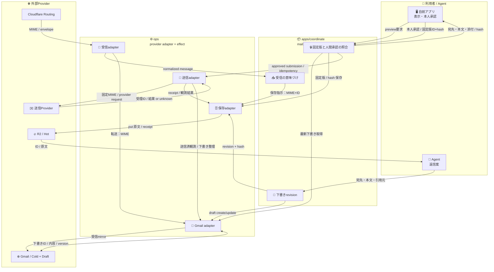

# 📬 Mail Cell — 実装予定tree・境界・データフロー（設計案）

Ref: [ADRS #578](https://github.com/roccho-dev/adrs/issues/578) / [apps #4](https://github.com/roccho-dev/apps/issues/4) / [mails #1](https://github.com/roccho-dev/mails/issues/1)

状態: **PROPOSAL / documentation only**。このファイルは採択済みADR、実装、デプロイ、外部送信の許可ではない。既存の `apps#4` の「mailはcoordinateのapp-local domain」という責務を維持する。

## 🎯 結論

- 🔥 R2 = 原文、immutable revision、送信版、承認/送信結果の運用記録
- ❄️ Gmail = 長期保管のmirror、編集可能な下書きUI（**送信権限の正本ではない**）
- 🖥️ 自前アプリ = 内容確認・人間の明示承認・送信要求だけ
- ⚙️ ops = provider adapter、実際の送信作用とreadback
- 🔐 envs = 認証・環境・secretの責務。具体名・targetは [envs側PR](https://github.com/roccho-org/envs/pulls) で扱う
- 送信は `@独自ドメイン`。Cloudflare Email Sending の用途制限が一般メールへ適合するか未確認のため、送信Providerは未固定。

## 🌳 具体的な完成予定tree（**未実装**）

```text
apps/
└─ packages/
   └─ coordinate/                    # 既存Purpose。「mail」専用packageは作らない
      ├─ src/
      │  ├─ mail/                    # app-local domain。Gmail/R2固有型を持たない
      │  │  ├─ contracts/
      │  │  │  ├─ message.jsonl      # 受信・参照
      │  │  │  ├─ draft.jsonl        # revision / hash / provenance
      │  │  │  ├─ submission.jsonl   # 固定版 / 承認 / idempotency
      │  │  │  └─ event.jsonl        # observation / receipt
      │  │  └─ ports/
      │  │     ├─ inbound.mjs        # normalize
      │  │     ├─ repository.mjs     # versioned revision
      │  │     └─ outbound.mjs       # approved send intent only
      │  └─ features/
      │     ├─ email-triage/         # 必要になってから
      │     ├─ email-draft/          # create/update/readback
      │     └─ email-submit/         # preview → approve → send request
      ├─ web/
      │  └─ mail-review/            # 自前アプリ：確認・承認のみ
      └─ tests/
         └─ mail/                    # 正常系・破壊的ケース
ops/
└─ packages/
   └─ cloudflare-adapter/email/      # provider-specific effect。appsに逆依存しない
      ├─ inbound.mjs
      ├─ r2.mjs
      ├─ gmail.mjs
      ├─ sender.mjs
      └─ readback.mjs
ui/
└─ packages/                         # 既存の表示・入力能力を必要な分だけ利用
roccho-org/envs/
├─ contracts/                        # source/target/secret names only
├─ ciphertexts/                      # 必要時のみ暗号化値
└─ handoffs/                         # effect後にのみreceipt
```

**最初のslice** は既存能力を使った draft → preview → approve → send request → receipt。全ファイルを一度に作らない。受信/R2/Gmail既存機能の有無と必要性を先に確認する。

## 🏗️ 構成 + エッジにデータを含むMermaid



## 🔑 エッジ契約・正本

| データ | 操作する層 | 版・権限 |
|---|---|---|
| 受信MIME | ops → R2 | 原文を保存。受信事実は送信許可ではない |
| 返信案 | Agent → apps/mail | proposalにすぎない |
| Gmail下書き | apps → ops/Gmail | 編集面。外部で変更・削除され得る |
| R2下書き | apps → ops/R2 | immutable revision、元下書きversionとの対応 |
| 送信対象 | apps固定版 → ops/R2 | 宛先・CC/BCC・本文・添付・Message-ID相当をhash |
| 承認 | Human → apps/admit | 本人認証＋表示済み固定版hash一致が必須 |
| 送信 | apps approved intent → ops | 未承認・改変・競合・重複は拒否 |
| 送信結果 | ops → R2、Gmail | receipt/readback。受付≠到達、UNKNOWNなら盲再送しない |

## 🚫 破綻防止・テスト予定（10+）

1. Agentが送信を直接呼び出す → 拒否。
2. 他人のセッションで承認 → 拒否。
3. preview後にGmail下書きが編集される → 再承認。
4. Gmail下書きが削除される → 古い版を黙送しない。
5. 添付・宛先・CC/BCC変更 → hash不一致で拒否。
6. 承認の二重クリック・並行要求 → 送信作用を多重発火しない。同時性は実装で実証。
7. 送信Providerがtimeout（成功不明） → UNKNOWN、盲再送なし。
8. provider受理レスポンスのみ → 送達済みと表示しない。
9. R2書込が失敗 → 固定版なしで送信しない。
10. Gmail cold mirrorだけ失敗 → R2正本を残し後で整合。
11. OAuth失効・scope不足 → draft readback失敗で送信停止。
12. 別ドメインのFrom / 未許可Provider → 送信拒否。
13. 入力メールに命令文がある → 外部メール本文を権限命令に使わない。
14. provider固有値(R2 ETag/Gmail draftId)がapps意味契約へ漏れる → adapter境界の検査。
15. 保持期間・個人情報削除が未定 → 実メール本番作用を許可しない。

## 📌 責務・完了条件

- `apps`: draft、承認候補、world patch、UIのproduct composition。
- `ops`: Cloudflare/Gmail/R2/送信Provider adapter、effects、readback。
- `ui`: 再利用可能な表示・入力能力のみ。`ui → apps`逆依存なし。
- `envs`: 非秘密契約、秘密の正本・必要先投影。GitHub Org SecretとCloudflare Worker runtime secretは別の配置。
- `adrs`: [#578](https://github.com/roccho-dev/adrs/issues/578)で意図・関係・採否を議論。この文書はadmissionを代行しない。

未達: 実source、プロバイダ実接続、E2E、権限分離実証、保持/削除方針、送信Provider適合判断。**実装・secret値の投入・外部送信・mergeは未許可。**
